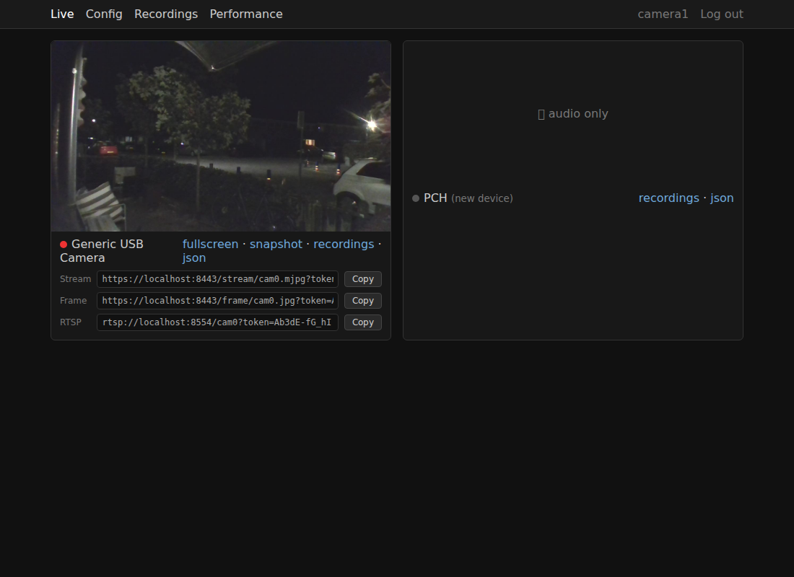
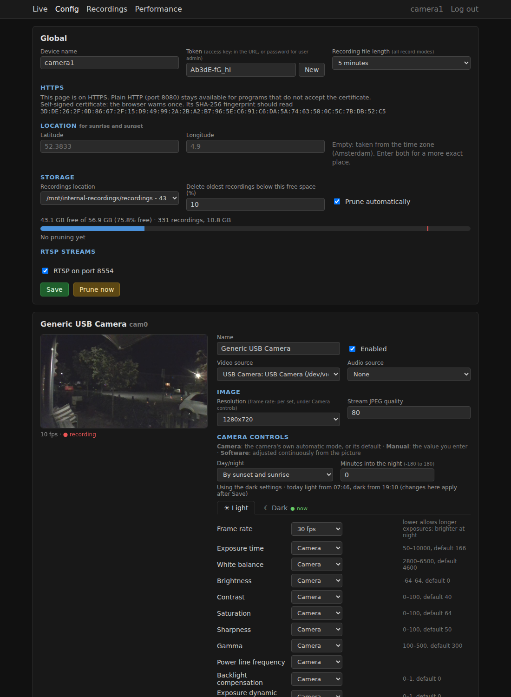

# Camera firmware

Turns a small Linux box with USB webcams into a network camera: live view in the browser,
recording, RTSP streams for other programs, and image controls that adapt to day and night.



## What it does

- **Live view** of every camera in the browser, also on phones, plus snapshot and MJPEG URLs
- **RTSP streams** (H.264, with audio when there is a microphone) for VLC, OBS, Home
  Assistant or an NVR
- **Recording** to mp4: always, on motion, or when a chosen object (person, car, cat, ...)
  is seen, with old recordings deleted automatically when the disk fills up
- **Image controls** per camera, left to the camera, set by hand, or adjusted continuously
  from the picture, with separate **day and night** settings switched by light level or by
  sunset and sunrise
- **Plug and play**: cameras and microphones are found when plugged in, any number of them
- **One token** protects everything, with HTTPS on a self-signed certificate
- **Performance** page with CPU, memory, GPU and disk over the last day



## Install

On a Debian or Ubuntu machine with a USB webcam:

```sh
sudo apt install python3-venv ffmpeg v4l-utils
git clone https://github.com/krakkus/camera-firmware.git
cd camera-firmware
python3 -m venv .venv && .venv/bin/pip install -r requirements.txt
cp config.example.json config.json
.venv/bin/python main.py
```

Open http://127.0.0.1:5000 and log in with the `token` from `config.json` (made on first
start). To reach it from other machines, set `"host": "0.0.0.0"` in `config.json`. To run
it as a service that starts at boot, see [Installation](docs/install.md).

## Documentation

Everything else (all settings, streams and their URLs, the API, how recording and the image
controls work) is in the **[documentation](docs/index.md)**.
