# Image controls

[Documentation](index.md) › Image controls

The Config page lists the controls the camera really has, read from the device: typically
exposure, white balance, brightness, contrast, saturation, sharpness, gamma, hue, gain,
backlight compensation and power line frequency. The names, ranges and defaults differ
per camera.

## Modes

Each control has a mode:

| Mode | The control is |
|---|---|
| **Camera** | left to the camera: its automatic mode where it has one (exposure, white balance), otherwise its default value |
| **Manual** | the value you enter, within the camera's range |
| **Software** | adjusted continuously by the firmware from the picture (exposure, contrast, brightness and gamma) |

## Software mode

Every 1.5 seconds the firmware measures the picture (ignoring its brightest 5%: sky,
lamps, headlights) and nudges one of the software controls, in turn:

| Control | Aims for | Notes |
|---|---|---|
| Exposure | mean brightness 100 (of 255) | never longer than one frame; if the picture is still too dark at that limit, it hands over to the camera's own auto exposure (which also raises gain) and tries again 5 minutes later, once the picture is bright |
| Contrast | spread (standard deviation) of at least 45 | only raises it for flat pictures, never flattens a scene below the camera's default; eases back to the default in very dark or very bright pictures, where more contrast only makes it worse |
| Brightness | black level (darkest 5%) near 12 | lifts the shadows; learns how strongly the camera reacts |
| Gamma | mean equal to median (balanced tones) | brightens a dark picture when exposure can do no more; does not brighten a picture that is already bright |

The **offset** slider (-100 to +100) moves what a control aims for: +100 means a mean
brightness 50 higher for exposure, a spread 30 higher for contrast, a black level 20
higher for brightness, a tone balance 10 higher for gamma. The text next to it shows the
target.

The value the loop has set is shown next to the control ("now ..."). If a camera accepts
exposure changes but ignores them, the loop notices and stops trying; the page says so.

When the picture has both blown-out highlights and crushed shadows (backlight, low sun),
no global control can fix it; the loop then leaves contrast, brightness and gamma near
their defaults instead of chasing either side.

## Light and dark sets

Each camera keeps two sets of controls, on the **Light** and **Dark** tabs. Each set has
its own mode, value and offset per control, and its own **frame rate**. The Dark set starts
as a copy of the Light set.

A lower frame rate lets the camera expose each frame longer: at 10 fps up to 100 ms, at
30 fps only 33 ms. At night that is the biggest single improvement: a brighter, less noisy
picture. The frame rate row shows the rate the camera actually delivers; it can be lower
than set when the camera slows down in the dark.

Switching to a set with another frame rate reopens the camera: the picture freezes for
about a second, but recordings carry on.

## Day/night switching

**Day/night** chooses when the Dark set applies:

| Setting | The Dark set applies |
|---|---|
| **Off** | never: one set, day and night |
| **By light level** | when the picture's mean brightness (0-255) stays below *Dark below* (default 30) for 2 minutes; the Light set returns when it stays above *Light again above* (default 80) for 2 minutes |
| **By sunset and sunrise** | from sunset until sunrise, moved by *Minutes into the night* (-180 to 180): +30 starts the night 30 minutes after sunset and ends it 30 minutes before sunrise |

**By light level**: the camera cannot report how much light there is, so the picture is
the measure, and the Dark set itself makes the picture brighter. Keep the gap between the
two thresholds wider than that, or it switches back and forth. The page shows the current
light level to help choose them.

**By sunset and sunrise**: computed with [astral](https://astral.readthedocs.io) for the
location under Global (latitude and longitude); left empty, a city in the system time zone
is used. Where the sun does not set or rise that day (far north or south), the whole day
uses the Light or the Dark set. The page shows today's switching times.

The Config page shows which set is in use, marked "● now" on its tab. The software loop
keeps running across a switch; manual and camera modes are applied at once.

## What each control does

The pictures below come from one webcam looking at a street, taken at four times of
day. Each row is one moment: at night (01:44), in the early morning (07:44), at midday
(13:44) and at dusk (19:44). The night, morning and dusk rows used the Dark set at 10 fps,
the midday row the Light set at 30 fps.

Each column is one value of the control, with all other controls left on Camera. "mean" is
the picture's mean brightness (0-255). In the software columns, the number in brackets is
the value the software loop settled on for that offset. People and number plates are
blurred. Other cameras have different ranges and react differently, so treat these as
examples, not rules.

### Exposure

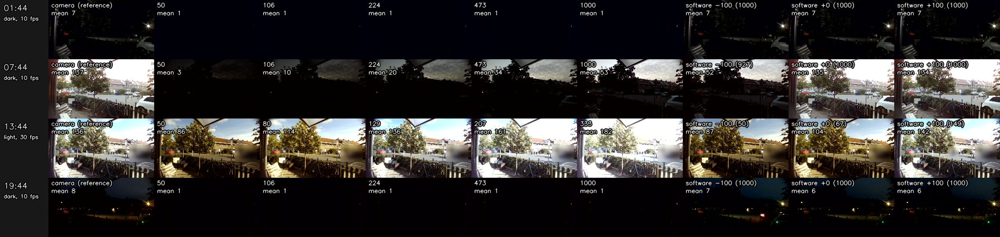

The unit is 0.1 ms, so 1000 is 100 ms. Manual exposure fixes the time but not the gain.
At night even 100 ms stays black (mean 1), while Camera mode reaches mean 7 because it also
raises the gain. In daylight it is the most direct control: 50 to 333 moves the mean from 86
to 182. Software follows its target in daylight. At night, when the longest exposure is not
enough, it hands over to the camera's own auto exposure, so its columns look like the
reference.

### White balance

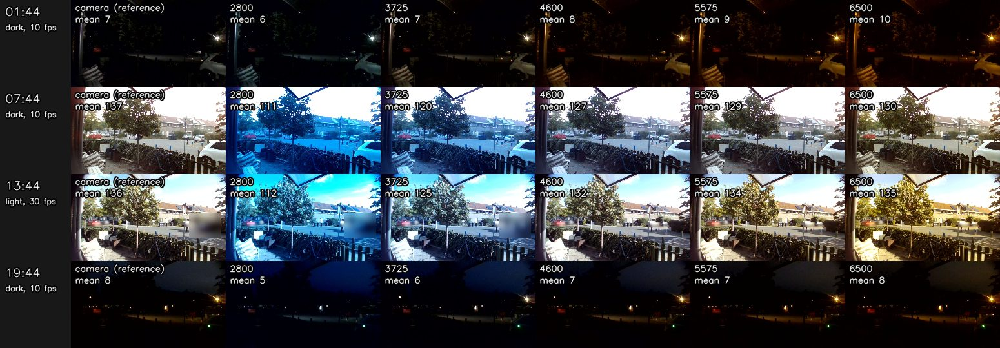

Low values (2800 K) make the picture bluer, high values (6500 K) yellower. Brightness
hardly changes. Under orange street lamps a low value gives more natural colours.

### Brightness

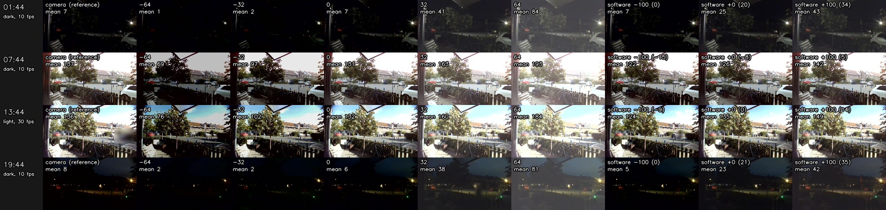

At night, brightness does the most. Manual 32 takes the night picture from mean 7 to 41,
and 64 to 84, but by raising the black level: it looks grey and foggy rather than
brighter. Software +100 lifts the night to mean 43 and only adds about 13 in daylight. It
works well in a Dark set; in daylight, manual 64 washes the picture out (mean 184).

### Contrast

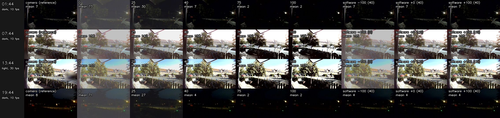

In daylight, 0 to 100 widens the spread (standard deviation) from 38 to 110. At night, low
contrast turns the picture into a flat grey (mean 73 at 0), and high contrast pushes
everything to black. Software leaves contrast at the default in the dark, so its night
columns match the reference.

### Saturation

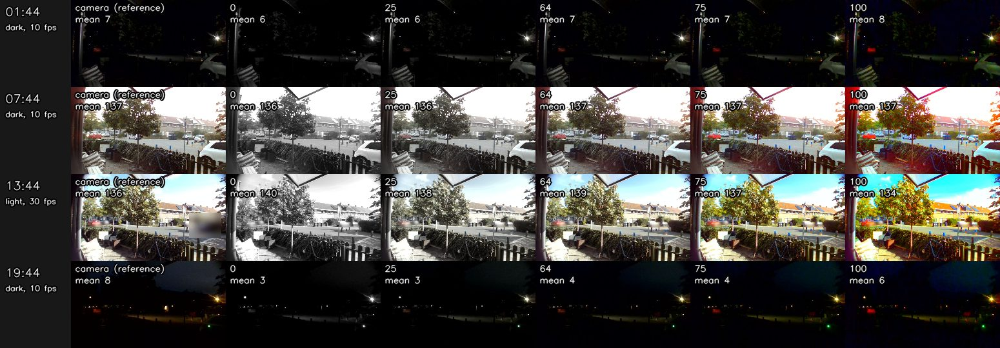

Colour only: 0 is greyscale, 100 gives strong colours. Brightness stays the same.

### Sharpness

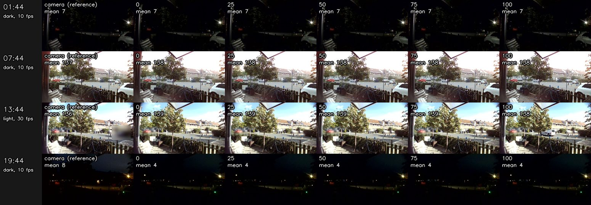

This camera shows hardly any difference between 0 and 100, day or night.

### Gamma

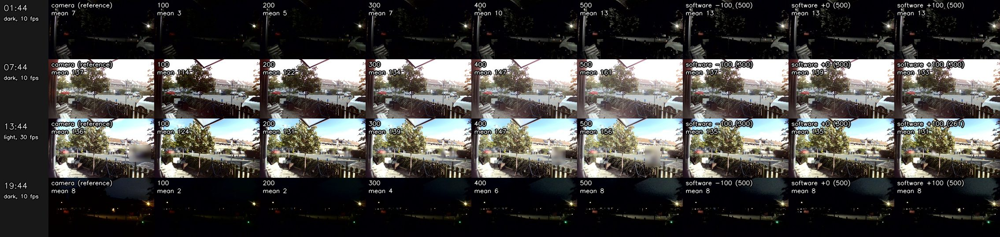

Higher values lift the mid tones and keep black and white where they are. In daylight, 100
to 500 moves the mean from 124 to 156 and the picture flattens. At night, 500 takes the
mean from 7 to 13, and Software ends up at the maximum. That helps less than brightness.

### Power line frequency

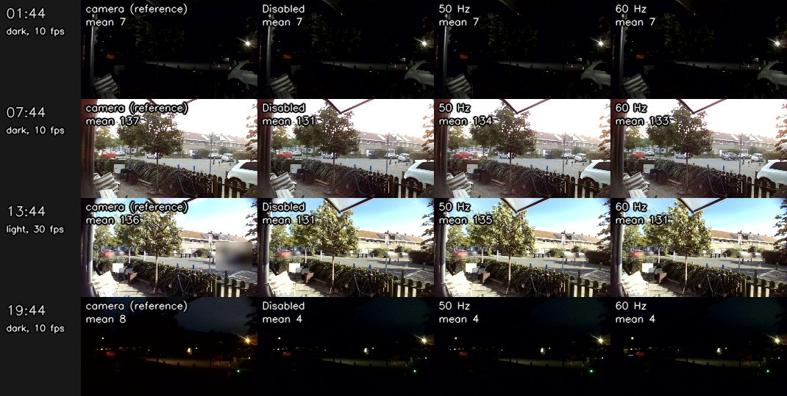

No visible difference here. Set it to your mains frequency (50 Hz in Europe) to avoid
flicker and rolling bands under fluorescent or LED lighting.

### Backlight compensation

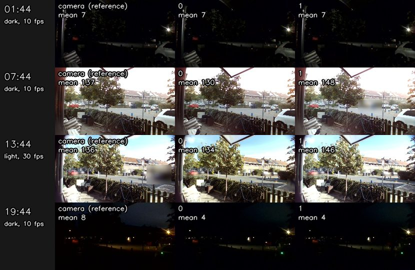

On (1) brightens a daylight picture by about 12-18 (mean) to bring out a dark foreground
against a bright sky. No effect at night.

### Exposure dynamic framerate

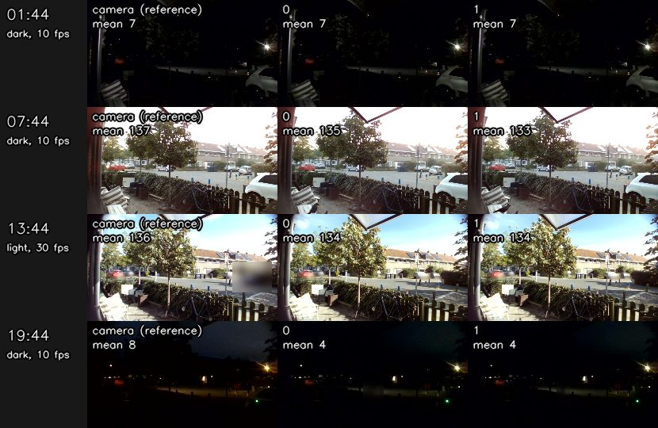

When on, the camera can lower its frame rate to expose longer. No difference here, because
the frame rate is already set per Light and Dark set.

### Hue

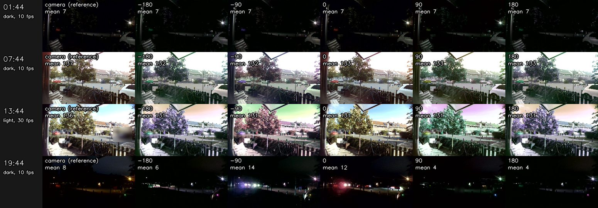

Rotates all colours: at -90 the red car turns purple, at +90 yellow, at ±180 green. Leave it at 0
unless the camera's colours are off.
