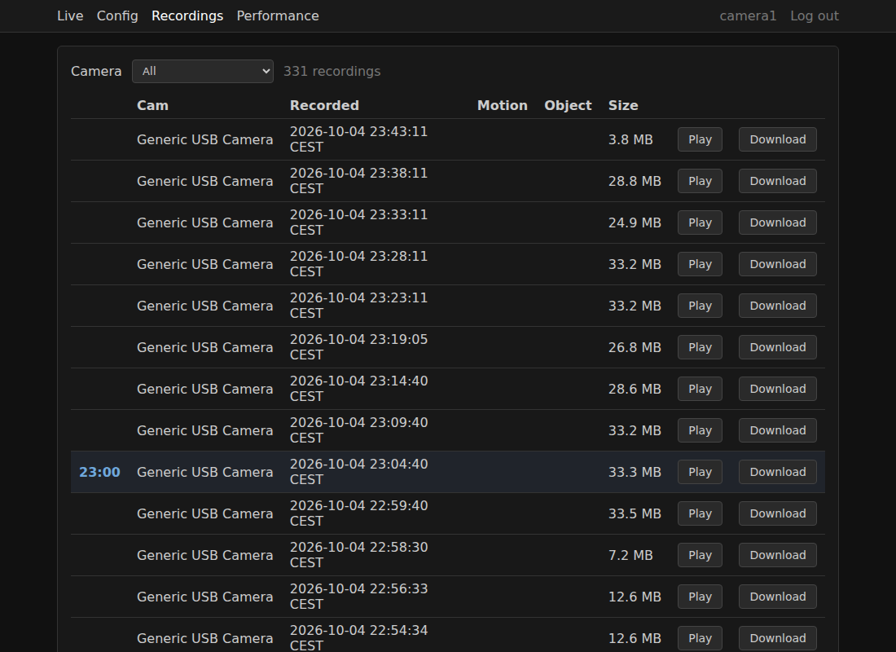
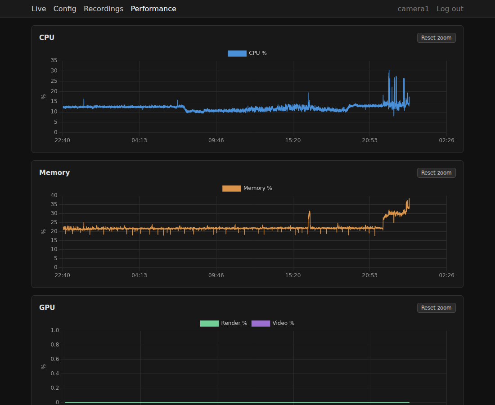

# Web pages

[Documentation](index.md) › Web pages

## Live

Every camera's live picture, side by side (one column on a phone). Per camera:

- a dot that turns red while it records
- **fullscreen**: the picture fills the browser window; click it or press Esc to close
- **snapshot**: the current frame as a JPEG
- **recordings**: that camera's recordings
- the **Stream**, **Frame** and **RTSP** URLs, token included, with a Copy button

A stream only runs while its picture is on screen and the page is visible. Phones that
drop the connection (screen lock, switching apps or networks) get it back when the page is
shown again. The page reloads itself when a camera is plugged in or removed.

## Config

**Global**: device name, the token, recording file length, HTTPS (address and certificate
fingerprint), location (for sunrise and sunset), RTSP, the storage location with its free
space, and pruning.

**Per camera**, with a live preview that shows the measured frame rate and whether it
records:

- name, enabled, video source, audio source
- resolution
- **camera controls**: day/night switching and the Light and Dark sets, each with a frame
  rate and every control the camera offers, see [Image controls](image-controls.md)
- orientation: rotation and flips
- recording: mode, quality, pre- and post-roll; motion and object detection settings
- Save, Restore defaults, Delete

At the bottom: adding a camera by URL or device path, and the list of detected devices
and which camera uses each. When a camera is plugged in or removed while the page is open,
a banner offers to reload it.

## Recordings

All recordings, newest first, grouped by hour in local time, filterable by camera. Each
plays in the page or downloads.

## Performance

CPU, memory, GPU, disk activity and free disk space over the last 24 hours, sampled every
10 seconds. Scroll to zoom, drag to pan.
